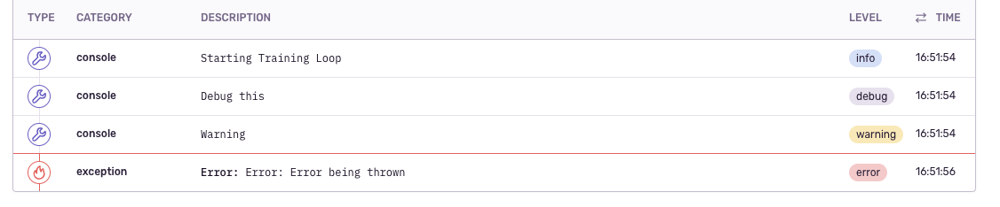

# Sentry LDK

This library is a wrapper of the [@sentry/browser](https://github.com/getsentry/sentry-javascript/tree/master/packages/browser) library for the use in Loops by creating a custom transport leveraging the Network Aptitude.

## Usage

All logs except for `console.error` will add a breadcrumb automatically through the `Console` integration. When a `console.error`
is called it will then call the `captureException` method from sentry and climb up the call stack storing all of the logs/breadcrumbs
along the way. `Sentry.init()` should be called as soon as possible it is recommended that is added to loop start up logic.

Note: Since this is a wrapper library most methods in the sentry documentation still work as intended and can be used like the @sentry/browser library. There is one caveat which is that loops run in a custom runtime and not all features of sentry may work (ex. integrations with things like the filesystem or history API)
[Sentry Javascript Docs](https://docs.sentry.io/platforms/javascript/)

```
// Loop Start up logic
import { ui, network } from '@oliveai/ldk';
import * as Sentry from 'sentry-loop-logging';

(async function main(): Promise<void> {
    Sentry.init({
      dsn: 'https://<dsn url> ',
    });
    try {
      console.log('Starting Loop'); // Adds a breadcrumb with a level of log
      console.debug('Debug this'); // Adds a breadcrumb with a level of debug
      console.warn('Warning');  // Adds a breadcrumb with a level of warn
      const req: network.HTTPRequest = {
        url: 'https://google.com',
        body: 'super cool thing',
        method: 'POST',
      };
      const response = await network.httpRequest(req);
    } catch (err) {
      // if any call fails and throws an error it will fall here
      // and the console.error call will send the error to sentry
      console.error(err);
    }
})();
```

### Important!
Since we are using the Network Aptitude the network permission will need to be add to the loop `package.json`permissions with the dsn url as one of the properties.

Above example in sentry would look something like this:


